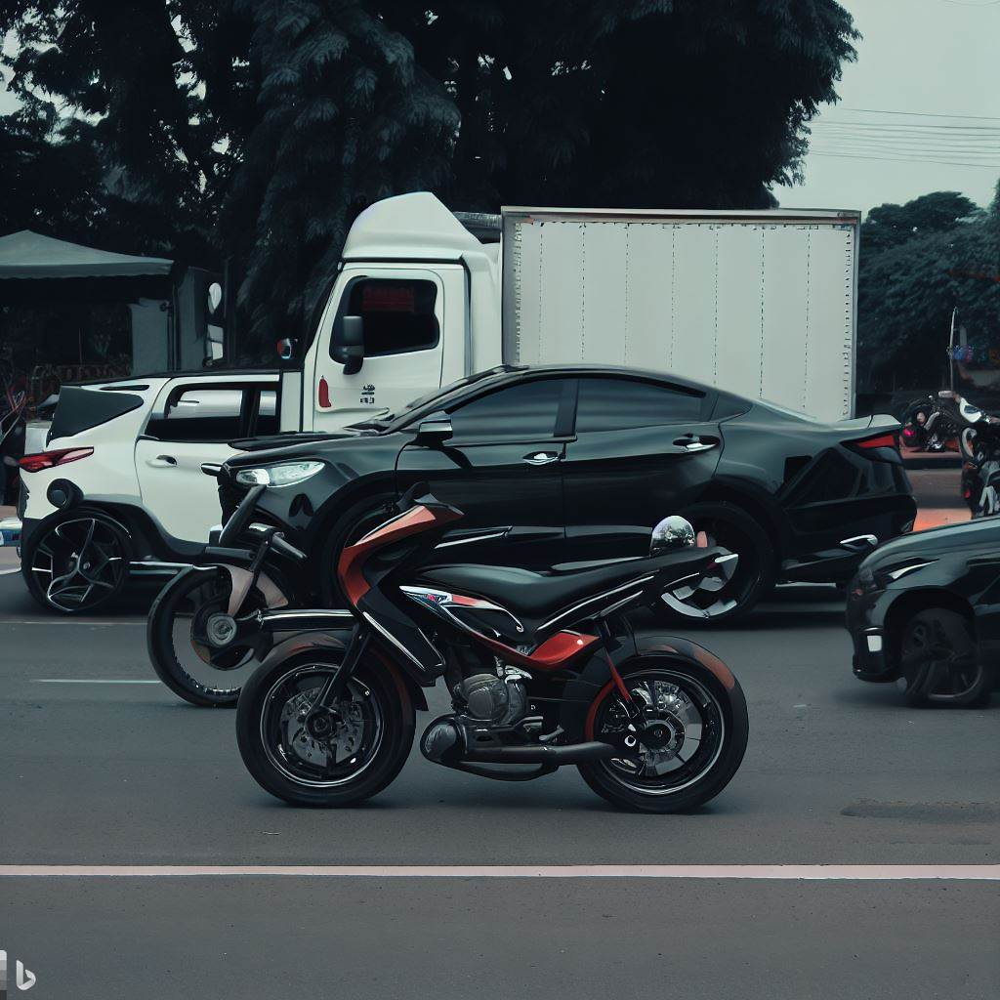

# Image Similarity AI Model

 (_Image Generated using bing ai_)

## Introduction

The primary goal of this project is to develop an AI model that can determine the most similar images within a given dataset. This is achieved by first training a classification model on the dataset. After successfully training the model, I use the output from the last hidden layer as a vector representation of each image. By employing cosine similarity, I can then compare these vectors to find the most similar images in the dataset.

**Please note that this project is purely a concept, and there is a possibility that it might not achieve the desired results**. My intention is to explore the concept and gain valuable insights, regardless of the final outcome.

The insights gained from this attempt, even if the project does not succeed, will be valuable for future iterations and developments in image comparison and similarity analysis. I welcome other researchers and developers to join me in this exploratory journey, as we learn from both successes and failures.

I hope this concept will inspire curiosity and creativity among the AI community. Should you choose to be a part of this exciting endeavor, I welcome your contributions and look forward to working together.

_Thank you for your interest in my Image Similarity AI Model project, and let's embark on this challenging yet rewarding exploration together!_

## Table of Contents

- [Introduction](#introduction)
- [Data](#data)
- [Preprocessing](#preprocessing)
- [Architecture](#architecture)
- [Installation](#installation)
- [Usage](#usage)
- [Dataset](#dataset)
- [Training](#training)
- [Evaluation](#evaluation)
- [Results](#results)
- [Contributing](#contributing)
- [License](#license)

## Data

The images were downloaded using [Download All Images](https://chrome.google.com/webstore/detail/download-all-images/ifipmflagepipjokmbdecpmjbibjnakm)

## Preprocessing

The Data was First Augmented using Albumentations Pipeline.

The below filters were applied to Images to augment them:
- Horizontal Flip
- Random Brightness Contrast
- Random Rotate 90
- Flip
- RGB Shift
- Hue Saturation Value
- CLAHE
- Random Gamma
- Blur
- To Gray
- Image Compression

The image was splitted into Train-Test-Valid sets with `75:10:15` ratio

## Architecture

This model uses a Convolutional Layers of [MobileNet](https://keras.io/api/applications/mobilenet/)

and then adds

- Global Flatten Layer
- Dense Layer with `512` outputs and ReLU activation
- Dense Layer with `64` outputs and ReLU activation
- Dense Layer with 1 output and Sigmoid activation

This Model used `Categorical Cross Entropy` Loss to learn with an `adam` optimizer

## Installation

[Will add installation instructions here later]

## Usage

[Will add usage instructions here later]

## Dataset

[Will add information about the dataset used for training and evaluation here]

## Training

[Will add information about the training process here]

## Evaluation

[Will add information about the evaluation process and metrics here]

## Results

[Will add the results of my experiments here]

## Contributing

[Will add guidelines for contributing to the project here]

## License

This project is Licensed under [MIT license](LICENSE.md).

---

_Thank you for showing interest in my Image Similarity AI Model project! I hope this concept will pave the way for exciting advancements in image comparison and similarity analysis. Should you have any questions or suggestions, feel free to reach out to me._
